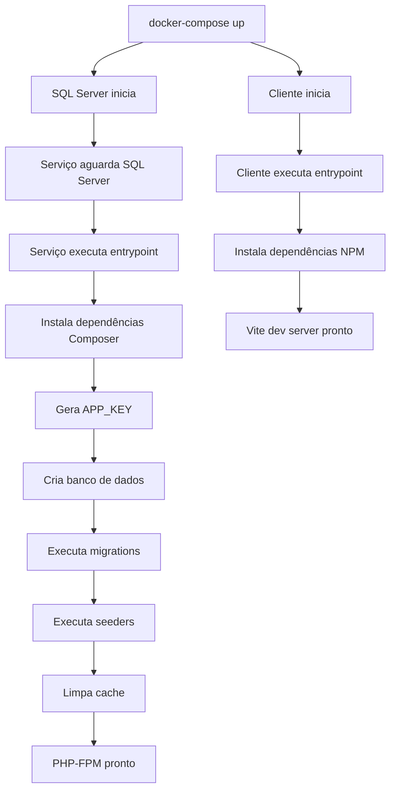

# Documentação dos Entrypoints

Este projeto utiliza scripts de entrypoint para automatizar a inicialização dos containers Docker.

## 📋 Visão Geral

Os entrypoints garantem que os containers sejam configurados automaticamente ao iniciar, executando:
- Instalação de dependências
- Configurações iniciais
- Migrations de banco de dados
- Seeds de dados
- Otimizações

## 🎨 Cliente (Frontend)

**Localização:** `codigo-fonte/cliente/entrypoint.sh`

### O que faz:

1. ✅ Verifica e instala dependências NPM (se necessário)
2. 🚀 Inicia o servidor de desenvolvimento Vite

### Uso:

```bash
# Executado automaticamente ao iniciar o container
docker-compose up cliente

# Ou manualmente dentro do container
docker-compose exec cliente sh
./entrypoint.sh
```

### Logs esperados:

```
🚀 Iniciando container do cliente...
📦 Instalando dependências do NPM...
# ou
✅ Dependências já instaladas
🎨 Iniciando servidor de desenvolvimento Vite...
```

## ⚙️ Serviço (Backend)

**Localização:** `codigo-fonte/servico/entrypoint.sh`

### O que faz:

1. ⏳ Aguarda o SQL Server estar disponível
2. 📦 Verifica e instala dependências do Composer (se necessário)
3. 📝 Copia .env.example para .env (se não existir)
4. 🔑 Gera chave da aplicação Laravel (se necessário)
5. 🗄️ Cria banco de dados (se não existir)
6. 🔄 Executa migrations
7. 🌱 Executa seeders (apenas se a tabela usuarios estiver vazia)
8. 🧹 Limpa cache
9. ⚡ Otimiza para produção (se APP_DEBUG=false)
10. 🎯 Inicia PHP-FPM

### Uso:

```bash
# Executado automaticamente ao iniciar o container
docker-compose up servico

# Ou manualmente dentro do container
docker-compose exec servico bash
./entrypoint.sh
```

### Logs esperados:

```
🚀 Iniciando container do serviço...
⏳ Aguardando SQL Server estar disponível...
✅ SQL Server disponível!
📦 Instalando dependências do Composer...
# ou
✅ Dependências do Composer já instaladas
🔑 Gerando chave da aplicação...
🗄️ Verificando banco de dados...
   Criando banco de dados sistema_votacao_cnt...
✅ Banco de dados criado!
🔄 Executando migrations...
🌱 Executando seeders...
🧹 Limpando cache...
✅ Container do serviço configurado com sucesso!
🎯 Iniciando PHP-FPM...
```

## 🔄 Fluxo de Inicialização



## 🚨 Troubleshooting

### Cliente não inicia

**Problema:** `npm install` falha

**Solução:**
```bash
# Remover node_modules e tentar novamente
docker-compose exec cliente sh
rm -rf node_modules package-lock.json
exit
docker-compose restart cliente
```

### Serviço não conecta ao SQL Server

**Problema:** "SQL Server não disponível ainda"

**Solução:**
```bash
# Verificar se o SQL Server está rodando
docker-compose ps sqlserver

# Verificar logs do SQL Server
docker-compose logs sqlserver

# Reiniciar o SQL Server
docker-compose restart sqlserver
```

### Migrations não executam

**Problema:** Erro ao executar migrations

**Solução:**
```bash
# Entrar no container e executar manualmente
docker-compose exec servico bash
php artisan migrate:fresh --seed
```

### Seeders já executados

**Observação:** Os seeders só são executados automaticamente se a tabela `usuarios` estiver vazia.

**Para forçar execução:**
```bash
docker-compose exec servico bash
php artisan db:seed --force
```

## 🔧 Desenvolvimento

### Modificar entrypoints

Após modificar os arquivos `entrypoint.sh`:

```bash
# Reconstruir as imagens
docker-compose build

# Reiniciar os containers
docker-compose up -d
```

### Desabilitar entrypoint temporariamente

Para entrar no container sem executar o entrypoint:

```bash
# Cliente
docker-compose run --entrypoint sh cliente

# Serviço
docker-compose run --entrypoint bash servico
```

## 📝 Variáveis de Ambiente Importantes

### Serviço

- `APP_DEBUG` - Se `false`, ativa otimizações de produção
- `DB_HOST` - Host do SQL Server (padrão: sqlserver)
- `DB_PORT` - Porta do SQL Server (padrão: 1433)
- `DB_DATABASE` - Nome do banco (padrão: sistema_votacao_cnt)
- `DB_USERNAME` - Usuário do SQL Server (padrão: sa)
- `DB_PASSWORD` - Senha do SQL Server (padrão: SistemaVotacao@2024)

### Cliente

- `VITE_API_URL` - URL da API backend (padrão: http://localhost:8000/api)

## ✅ Checklist de Inicialização

Após executar `docker-compose up -d`, verifique:

- [ ] Container `sistema-votacao-sqlserver` está rodando
- [ ] Container `sistema-votacao-servico` está rodando
- [ ] Container `sistema-votacao-nginx` está rodando
- [ ] Container `sistema-votacao-cliente` está rodando
- [ ] Backend responde em http://localhost:8000/api
- [ ] Frontend responde em http://localhost:3000
- [ ] Banco de dados `sistema_votacao_cnt` foi criado
- [ ] Tabelas foram criadas (usuarios, propostas, votos)
- [ ] Usuário admin foi criado (CPF: 12345678901)

## 🎯 Primeira Execução

```bash
# 1. Iniciar todos os containers
docker-compose up -d

# 2. Acompanhar os logs
docker-compose logs -f

# 3. Aguardar até ver "PHP-FPM pronto" e "Vite dev server pronto"

# 4. Acessar o sistema
# Frontend: http://localhost:3000
# Login: CPF 12345678901, Senha admin123
```

## 🔄 Reconstruir do Zero

Para reconstruir todo o ambiente:

```bash
# Parar e remover containers
docker-compose down -v

# Reconstruir imagens
docker-compose build --no-cache

# Iniciar novamente
docker-compose up -d
```

---

**Nota:** Os entrypoints foram projetados para serem **idempotentes**, ou seja, podem ser executados múltiplas vezes sem causar problemas. Eles verificam o estado antes de executar cada ação.
